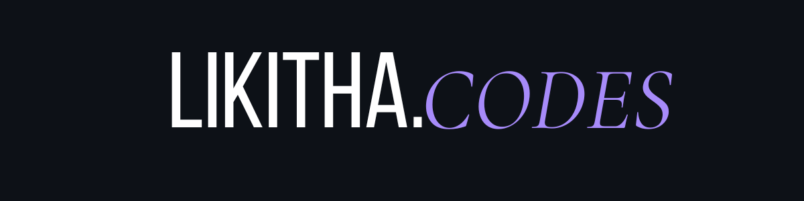

<picture>
  <source media="(prefers-color-scheme: dark)" srcset="https://raw.githubusercontent.com/likitha-codes/likitha-codes/output/github-contribution-grid-snake-dark.svg">
  <source media="(prefers-color-scheme: light)" srcset="https://raw.githubusercontent.com/likitha-codes/likitha-codes/output/github-contribution-grid-snake.svg">
  
</picture>

---

## Tech Stack

---

## About

Passionate about building AI-powered experiences that solve real-world problems through clean design and smart functionality.
Learning: LLM APIs, and system design
- Artificial Intelligence
- Backend Development
- Automation
- Human-centered Tech
- Scalable Web Applications
- Open to collaborating on open source & AI-powered projects
- Ask me about: MERN stack, building with GenAI, or getting started in web dev
- Hyderabad, India &nbsp;|&nbsp; 🟢 Open to opportunities

---

## Featured Projects

[VitaeX](https://github-readme-stats.vercel.app/api/pin/?username=likitha-codes&repo=VitaeX&theme=github_dark&hide_border=true&bg_color=0d1117&title_color=a78bfa&icon_color=a78bfa)](https://github.com/likitha-codes/VitaeX)

[Iris Study Buddy](https://github-readme-stats.vercel.app/api/pin/?username=likitha-codes&repo=Iris-Study-Buddy&theme=github_dark&hide_border=true&bg_color=0d1117&title_color=a78bfa&icon_color=a78bfa)](https://github.com/likitha-codes/Iris-Study-Buddy)

---

## Let's Connect

---

  // building one commit at a time · likitha-codes

